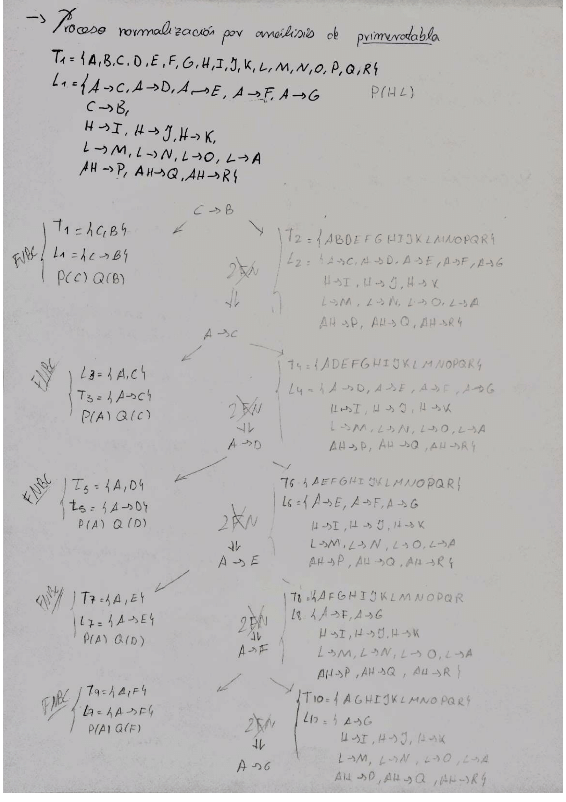
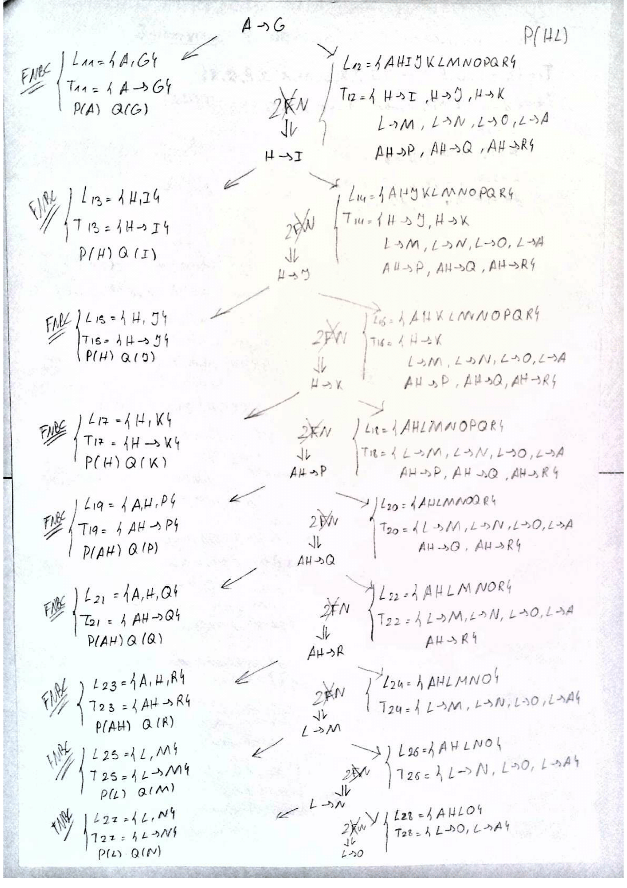
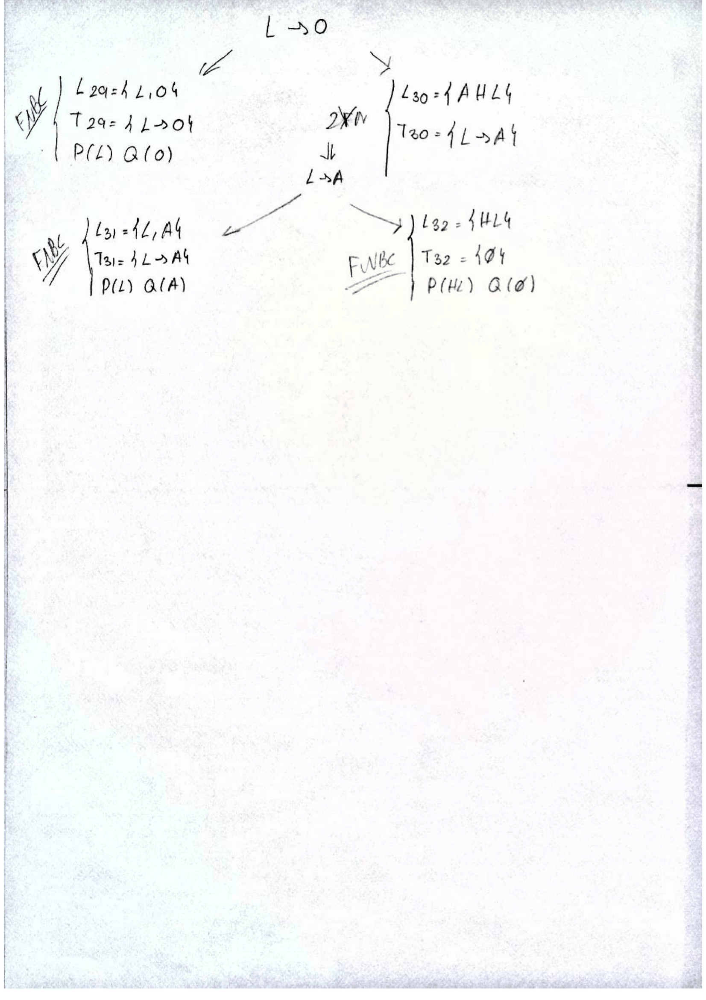
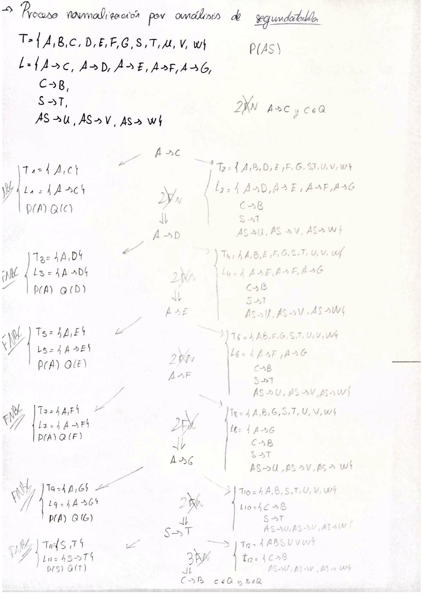
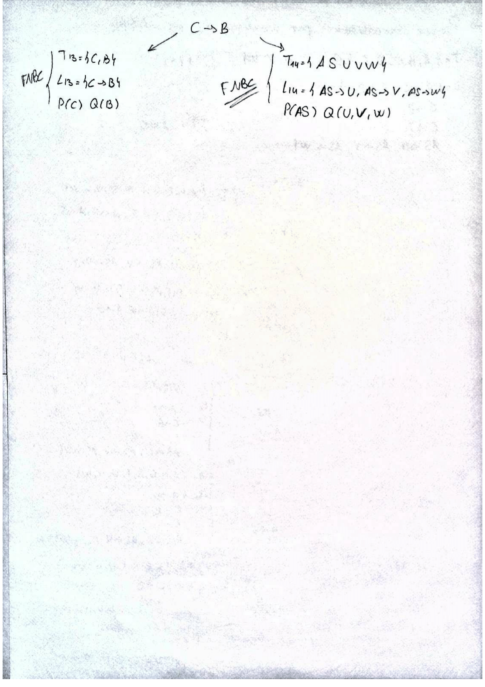

# Práctica 1 - Diseño de modelo relacional

Realizado por:

* Francisco Rodríguez Cuenca
* Alejadro Lozano Morales

## Ejercicio 1

### **Determinar el grado de normalización de estas dos relaciones, indicando las claves existentes. Se asume que el conjunto de dependencias L1 y L2 representan, de manera independiente, un recubrimiento mínimo y no redundante.**

* Primera tabla

    * Clasificación de atributos

            Esenciales = {H,L}
            Posibles = {C,A}
            No posibles = {B,D,E,F,G,I,J,K,M,N,O,P,Q,R}

    * Claves finales

            Clave = HL

    * Forma Normal

            Primera forma normal ya que H → I, siendo H subclave

* Segunda tabla

    * Clasificación de atributos

            Esenciales = {A,S}
            Posibles = {C}
            No posibles = {B,D,E,F,G,T,U,V,W}

    * Claves finales

            Clave = AS

    * Forma Normal

            Primera forma normal ya que A → C, siendo A subclave

## Ejercicio 2

### **Modificar con SQL el esquema de las dos tablas EXCLUSIVAMENTE para dar de alta la clave primaria elegida para cada una de ellas en el apartado anterior**

````sql
    ALTER TABLE primeratabla ADD CONSTRAINT pk_primeratabla PRIMARY KEY(player_id,play_id);

    ALTER TABLE segundatabla ADD CONSTRAINT pk_segundtabla PRIMARY KEY(game_id,team_id);
````

## Ejercicio 3

### **Resolver en SQL las siguientes consultas:**

#### a. ¿Cuántos partidos ha jugado en el año 2013 el equipo de nombre Blackhawks?

````sql
    USE practica1bda;
    SELECT COUNT(*) AS Num_Partidos_Jugados
    FROM segundatabla s
    WHERE year(date_time)='2013'
    AND teamName= 'BlackHawks'
````

#### b. Por cada partido registrado en el mes de enero de 2013, mostrar el nombre de los equipos locales

````sql
    USE practica1bda;
    SELECT date_time AS Fecha_Partido, s.TeamName AS EquipoLocal
    FROM segundatabla s
    WHERE year(date_time)='2013'
        AND month(date_time)='01'
        AND s.team_id=s.home_team_id;
````

#### c. Por cada equipo, mostrar su identificador, nombre, y estadísticas (tgoals, tshots y thits) en los partidos jugados en 2013 como equipos locales

````sql
    USE practica1bda;
    SELECT s.TeamName AS EquipoLocal,s.tgoals AS Goles,s.tshots AS Tiros,s.thits AS Golpes,s.date_time AS Fecha_Partido
    FROM segundatabla s
    WHERE year(date_time)='2013'
        AND s.team_id=s.home_team_id;
````

#### d. Obtener, para cada partido que haya jugado el o los equipo(s) en los que haya jugado el jugador Adam McQuaid, el identificador del equipo, el nombre del equipo, el año, mes y día del partido y el identificador de cada jugada realizada junto con su descripción (event) para cada una de las jugadas que haya realizado el equipo en cada partido (event) ordenadas por la fecha del partido

````sql
    USE practica1bda; 
    SELECT p.date_time,p.play_id,p.event, s1.teamName As NombreAgainst, s2.teamName AS NombreFor
    FROM primeratabla p
        INNER JOIN segundatabla s1 ON s1.team_id = p.team_id_against
        INNER JOIN segundatabla s2 ON s2.team_id = p.team_id_for
    WHERE p.firstName='Adam'
        AND p.lastname = 'McQuaid'
    GROUP BY p.team_id_for,p.team_id_against, p.event
    ORDER BY p.date_time;
````

    Hemos realizado dos copias de segundatabla (s1 y s2) para poder obtener simultaneamente los nombres del equipo_for y el equipo_against, ya que con una sola copia no podríamos realizarlo.

## Ejercicio 4

### **Insertar mediante SQL, si es posible, (manteniendo las claves primarias creadas) los siguientes datos, explicando los problemas y anomalías encontradas en caso de haberlos:**

#### a. Los datos del nuevo jugador que se llama Samuel Smithson y es canadiense (CAN) y al que se le ha asignado el identificador 5554441

````sql
    USE practica1bda;

    INSERT INTO primeratabla (firstname,lastname,nationality,player_id)
        VALUES ('Samuel','Smithson','CAN',5554441);
````

    Al ser una clave compuesta por Player_id(H) y Play_id(L) y tener solo
    valor para player_id(H) nos da una ANOMALIA DE INSERCIÓN por falta
    de valor en clave principal(HL)

#### b. El partido de código 2012030999 entre los “Red Wings” (locales) y los “Penguins” que terminó 3 a 2 a favor de los locales

````sql
    USE practica1bda;

    INSERT INTO segundatabla (game_id,team_id,home_goals,away_goals,teamName,home_team_id,away_team_id)
        VALUES (2012030999,
                        (SELECT s.team_id
                        FROM segundatabla s
                        WHERE s.teamName = 'Red Wings'
                        GROUP BY s.team_id)
                    ,3,2,'Red Wings',
                        (SELECT s.team_id
                        FROM segundatabla s
                        WHERE s.teamName = 'Red Wings'
                        GROUP BY s.team_id)
                    ,(SELECT s.team_id
                        FROM segundatabla s
                        WHERE s.teamName = 'Penguins'
                        GROUP BY s.team_id));
    INSERT INTO segundatabla (game_id,team_id,home_goals,away_goals,teamName,home_team_id,away_team_id)
        VALUES (2012030999,
                        (SELECT s.team_id
                        FROM segundatabla s
                        WHERE s.teamName = 'Penguins'
                        GROUP BY s.team_id)
                    ,3,2,'Red Wings',
                        (SELECT s.team_id
                        FROM segundatabla s
                        WHERE s.teamName = 'Red Wings'
                        GROUP BY s.team_id)
                    ,(SELECT s.team_id
                        FROM segundatabla s
                        WHERE s.teamName = 'Penguins'
                        GROUP BY s.team_id));
````

    En este caso al tener valores para la clave compuesta no nos da
    ningún error al insertar, sin embargo,los datos identificativos los 
    hemos tenido que obtener a partir de consultas.


#### c. Los datos de un nuevo equipo, denominado “Lasters” y cuyo código será 99

````sql
    USE practica1bda;

    INSERT INTO segundatabla(teamName,team_id)
        VALUES ('Lasters',99);
````

        ANOMALIA DE INSERCIÓN por falta de valor en game_id(A) y al ser AS clave principal compuesta

## Ejercicio 5

### **Actualizar el resultado del partido de código '2012020053' ya que el partido terminó realmente 5 a 3 en vez de 6 a 4 como figura. Comentar problemas y anomalías si las hay.**

````sql
    USE practica1bda;

    UPDATE segundatabla SET home_goals=5,away_goals=3
            WHERE game_id=2012020053;
````

## Ejercicio 6

### **A partir de febrero de 2013, el equipo denominado “Wild” pasa a denominarse “Wild Side”. Reflejar este hecho en las tablas, explicando problemas y anomalías. Comentar si surge algún problema entre datos en las tablas y las dependencias funcionales.**

````sql
    USE practica1bda;

    UPDATE segundatabla SET teamName='Wild Side'
            WHERE team_id in (SELECT s.team_id
                                FROM segundatabla s
                                WHERE s.teamname = 'Wild'
                                GROUP BY s.team_id)
                AND month(date_time)>='02'
                AND year(date_time)>='2013'
                AND teamName='Wild';
````

## Ejercicio 7

### **Normalizar R hasta conseguir un conjunto de relaciones que estén en FNBC mediante el algoritmo de descomposición con LJ. Explicar todos los pasos dados.**







##### Las soluciones se pueden agrupar en las siguientes tablas:

#### 1

| T | L |
| :---: |:---:|
|H,I,J,K|H→I, H→J, H→K|

#### 2

| T | L |
| :---: |:---:|
|S,T|S→T|

#### 3

| T | L |
| :---: |:---:|
|B,C|C→B|

#### 4

| T | L |
| :---: |:---:|
|A,H,P,Q,R|AH→P, AH→Q, AH→R|

#### 5

| T | L |
| :---: |:---:|
|A,S,U,V,W|AS→U, AS→V, AS→W|

#### 6

| T | L |
| :---: |:---:|
|A,L,M,N,O| L→M, L→N, L→O, L→A|

#### 7

| T | L |
| :---: |:---:|
|A,C,D,E,F,G| A→C, A→D, A→E, A→F, A→G|

#### 8

| T | L |
| :---: |:---:|
|H,L| |

## Ejercicio 8

### **Normalizar R mediante el algoritmo de síntesis para conseguir un conjunto de relaciones que estén, al menos, en 3FN. Explicar los pasos dados y comparar el resultado con el punto 7.**

#### Primera Tabla

| T | L |
| :---: |:---:|
|A,B,C,D,E,F,G,H,I,J,K,L,M,N,O,P,Q,R| A→C,A→D,A→E,A→F,A→G,C→B,H→I,H→J,H→K,L→M,L→N,L→O,L→A, AH→P,AH→Q,AH→R|

##### Recubrimiento mínimo

    El recubrimiento mínimo ya está calculado y nos lo da el enunciado

##### Cálculo claves

    La clave de la primera tabla es HL

##### Cálculo de la forma normal

    Está en primera forma normal

##### Agrupar dependencias que tengan el mismo implicante

| T | L |
| :---: |:---:|
|H,I,J,K|H→I, H→J, H→K|
|B,C|C→B|
|A,H,P,Q,R|AH→P, AH→Q, AH→R|
|A,L,M,N,O| L→M, L→N, L→O, L→A|
|A,C,D,E,F,G| A→C, A→D, A→E, A→F, A→G|
|S,T|S→T|

#### Segunda Tabla

| T | L |
| :---: |:---:|
|A,B,C,D,E,F,G,S,T,U,V,W| A→C,A→D,A→E,A→F,A→G,C→B,S→T,AS→U,AS→V,AS→W |
|A,S,T,U,V,W|AS→U, AS→V, AS→W|


##### Recubrimiento mínimo

    El recubrimiento mínimo ya está calculado y nos lo da el enunciado

##### Cálculo claves

    La clave de la primera tabla es AS

##### Cálculo de la forma normal

    Está en primera forma normal

##### Agrupar dependencias que tengan el mismo implicante

| T | L |
| :---: |:---:|
|B,C|C→B|
|A,C,D,E,F,G| A→C, A→D, A→E, A→F, A→G|
|A,S,U,V,W|AS→U, AS→V, AS→W|


## Ejercicio 9

### **Dibujar un modelo entidad/relación que se corresponda con lo obtenido en el paso 7 y, si se encuentra alguna irregularidad, revisar el diseño obtenido realizando justificadamente los cambios que se estimen oportunos sin perder la normalización efectuada.**

## Ejercicio 10

### **Escribir un script SQL para crear las tablas resultantes ya normalizadas y revisadas del punto 9, con sus correspondientes claves primarias y foráneas en la base de datos “practica1bda”.**

## Ejercicio 11

### **Insertar los datos en las tablas normalizadas desde las tablas originales (ignorar los cambios de los apartados 4, 5 y 6, volviendo a crear las dos tablas desde los ficheros originales si es necesario) en sus correspondientes tablas mediante las correspondientes sentencias “INSERT INTO … SELECT ...”.**

## Ejercicio 12

### **Repetir los puntos 3 al 6 con la nueva base de datos. Comentar y justificar razonadamente las diferencias encontradas en cada punto.**
